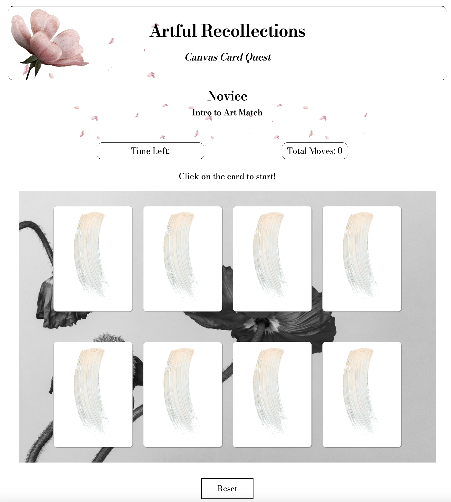

# Artful Recollections: Canvas Card Quest
Welcome to the *Canvas Card Quest!* This interactive game combines the joy of art appreciation with the challenge of memory and concentration.
I chose to create this card matching game as a way to combine my passion for art and gaming. I've always been fascinated by the power of visual expression and wanted to create an interactive experience that allows players to engage with stunning artworks.

## How to Play
1. **Objective:** 
- Match pairs of art cards by flipping them over two at a time.
2. **Getting Started:**
- Click on a card to flip it over.
- Try to remember the art piece and its location.
3. **Matching:**
- Find another card with the same art piece.
- Click on it to create a match.
4. **Winning:**
- Match all the cards to win the game.

## Features
- **Beautiful Artwork:** Explore a collection of stunning art pieces.

- **Difficulty Levels:** Choose from multiple difficulty levels (novice, proficient, maestro) to test your memory skills.

- **Move Counter:** Keep track of the total moves you make in the game.

- **Countdown Timer:** Race against the clock and try to finish the game before time runs out.

- **Reset Functionality:** Start a new game anytime with the reset button.

- **Sound Effects:** Immerse yourself in the game with interactive sound effects. 

- **Falling Petals Animation:** Enjoy a visual performance as delicate petals gently falling across the screen.

## [Begin your immersive gaming quest now.](https://artful-recollections-quest.netlify.app/)
## Technologies Used
- HTML
- CSS
- JavaScript
- Git

## Credits
- **Artwork:** [Paintings](https://www.rawpixel.com/)
- **Audio:** [Sound Effect](https://freesound.org/people/SergeQuadrado/sounds/460658/)
- **Animation:** [Blossom Petals Falling](https://codepen.io/rudtjd2548/pen/qBpVzxP)

## Ice Box: Future Improvements
- [x] **Levels of Difficulty**
- [x] **Font Design**
- [x] **Sound**
- [x] **Animation**
- [ ] **Theme Customization**
- [ ] **Leaderboard**
- [ ] **Accessibility Impovements**
- [ ] **Mobile Optimization**

## Author 🌸
Mariia Zhuravleva | [LinkedIn](https://www.linkedin.com/in/mariia-zhuravleva-5232b3219/)

